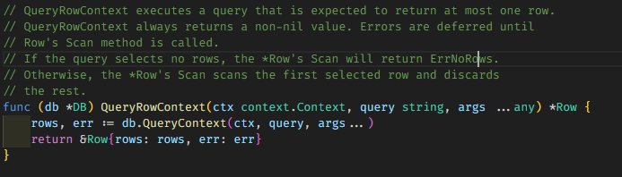

### MỘT SỐ CHÚ Ý KHI LÀM VIỆC VỚI GDBC

#### 1. Sử dụng **gdbc.QueryRow()**
##### 1.1. Scan data vào object mong muốn
Khi thực hiện query dữ liệu sử dụng gdbc.QueryRow. Kết quả ta nhận được là 1 instance *sql.Row.
Từ instance *sql.Row này, ta scan lần lược các column vào fields của object mà ta mong muốn.
```go
type templateEntity struct {
	TName     *string `db:"template_name"`
	TRequest  *string `db:"template_request"`
	TResponse *string `db:"template_response"`
}

func (repo *templateDataRepository) getTemplateFromDatabase(ctx context.Context, templateName string) (string, error) {
	sqlQuery := "SELECT TEMPLATE_NAME, TEMPLATE_REQUEST, TEMPLATE_RESPONSE FROM GW_XSLTEMPLATES WHERE TEMPLATE_NAME = $1"
	tempEntity := new(templateEntity)
	err := repo.db.QueryRow(ctx, sqlQuery, templateName).Scan(tempEntity.TName, tempEntity.TRequest, tempEntity.TResponse)
	if errors.Is(err, sql.ErrNoRows) {
		return "", fmt.Errorf("template not found")
	}

	if err != nil {
		return "", fmt.Errorf("failed to get template. %w", err)
	}

	return *tempEntity.TRequest, nil
}

```
Chú ý: Hàm QueryRow sẽ luôn trả kết quả là 1 instance *sql.Row non-nil nên ta có thể tiến hành scan ngay sau khi gọi hàm **gdbc.QueryRow()** 


// Nguồn: Thư viện sqlx

##### 1.2. Xử lý lỗi
Khi xử dụng hàm **gdbc.QueryRow()** và Scan data vào object đích, nếu không lỗi gì xảy ra và có dữ liệu trả về từ database, object đích sẽ được scan data vào các fields dữ liệu.
Ngược lại, ta sẽ có 2 trường hợp:
- **Trường hợp 1**: Không có lỗi khi thực hiện query nhưng không tìm thấy dữ liệu, lúc này hàm **Scan()** sẽ trả ra lỗi **sql.ErrNoRows**. Đối với trường hợp này chúng ta có thể kiểm\
tra và trả lỗi tùy nghiệp vụ hoặc cách xử lý:
```go
err := repo.db.QueryRow(ctx, sqlQuery, templateName).Scan(tempEntity.TName, tempEntity.TRequest, tempEntity.TResponse)
if errors.Is(err, sql.ErrNoRows) {
    return "", fmt.Errorf("template not found")
}
```

- **Trường hợp 2**: Có lỗi khi thực hiện query (Database not found, Sai query,...). Đối với trường hợp này chúng ta có thể kiểm\
tra và trả lỗi tùy nghiệp vụ hoặc cách xử lý:
```go
err := repo.db.QueryRow(ctx, sqlQuery, templateName).Scan(tempEntity.TName, tempEntity.TRequest, tempEntity.TResponse)
if errors.Is(err, sql.ErrNoRows) {
    return "", fmt.Errorf("template not found")
}

if err != nil {
    return "", fmt.Errorf("failed to get template. %w", err)
}

```

#### 2. Sử dụng gdbc.Get()
##### 2.1. Get data và fulfill data vào một object mong muốn
Khi thực hiện query dữ liệu sử dụng gdbc.Get. Nếu có dữ liệu trả về từ database, Object đích của chúng ta cung cấp sẽ được scan data vào các fields dữ liệu.
Hoặc ngược lại, nếu có lỗi thì một instance errors.Error sẽ được trả về

```go
type templateEntity struct {
	TName     *string `db:"template_name"`
	TRequest  *string `db:"template_request"`
	TResponse *string `db:"template_response"`
}

func (repo *templateDataRepository) getTemplateFromDatabase(ctx context.Context, templateName string) (string, error) {
	sqlQuery := "SELECT TEMPLATE_NAME, TEMPLATE_REQUEST, TEMPLATE_RESPONSE FROM GW_XSLTEMPLATES WHERE TEMPLATE_NAME = $1"
	tempEntity := new(templateEntity)
	err := repo.db.Get(ctx, tempEntity, sqlQuery, templateName)
	if errors.Is(err, sql.ErrNoRows) {
		return "", fmt.Errorf("template not found")
	}

	if err != nil {
		return "", fmt.Errorf("failed to get template. %w", err)
	}

	return *tempEntity.TRequest, nil
}
```
##### 2.2. Xử lý lỗi
Xử lý lỗi tương tự như khi xử dụng hàm [gdbc.QueryRow()](#12-xử-lý-lỗi)
- **Trường hợp 1**: Không có lỗi khi thực hiện query nhưng không tìm thấy dữ liệu, lúc này hàm **Scan()** sẽ trả ra lỗi **sql.ErrNoRows**. Đối với trường hợp này chúng ta có thể kiểm\
tra và trả lỗi tùy nghiệp vụ hoặc cách xử lý:
```go
err := repo.db.QueryRow(ctx, sqlQuery, templateName).Scan(tempEntity.TName, tempEntity.TRequest, tempEntity.TResponse)
if errors.Is(err, sql.ErrNoRows) {
    return "", fmt.Errorf("template not found")
}
```

- **Trường hợp 2**: Có lỗi khi thực hiện query (Database not found, Sai query,...). Đối với trường hợp này chúng ta có thể kiểm\
tra và trả lỗi tùy nghiệp vụ hoặc cách xử lý:
```go
err := repo.db.QueryRow(ctx, sqlQuery, templateName).Scan(tempEntity.TName, tempEntity.TRequest, tempEntity.TResponse)
if errors.Is(err, sql.ErrNoRows) {
    return "", fmt.Errorf("template not found")
}

if err != nil {
    return "", fmt.Errorf("failed to get template. %w", err)
}
```

#### 3. Hàm gdbc.Select()
Hàm **gdbc.Select()** query dữ liệu từ database và scan vào một slice thay vì vào một object đích như hàm [gdbc.Get()](#2-sử-dụng-gdbcget) và trả ra error nếu có lỗi khư thực hiện query
```go
users :=  &[]datamodel.User{}
sql := "Select id, name, code from users where company_id="
err := gdbc.Select(ctx, users, query, companyID)

if err != nil {
    return "", fmt.Errorf("failed to get data. %w", err)
}

```